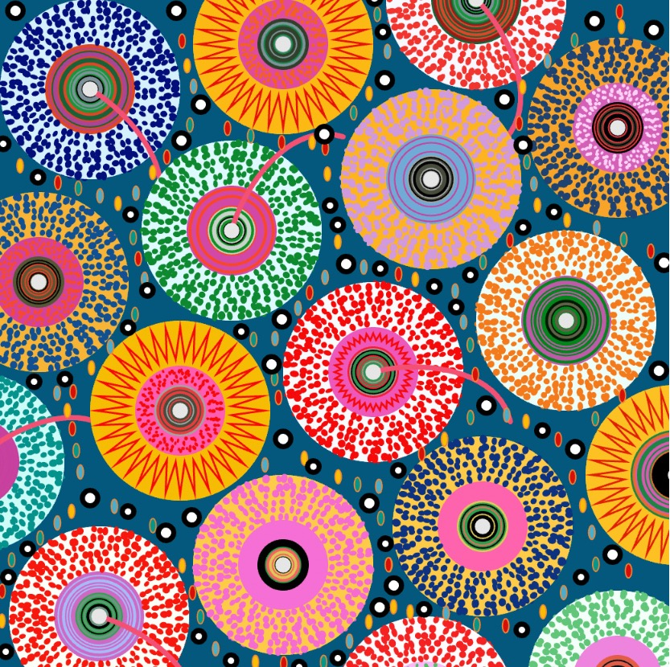
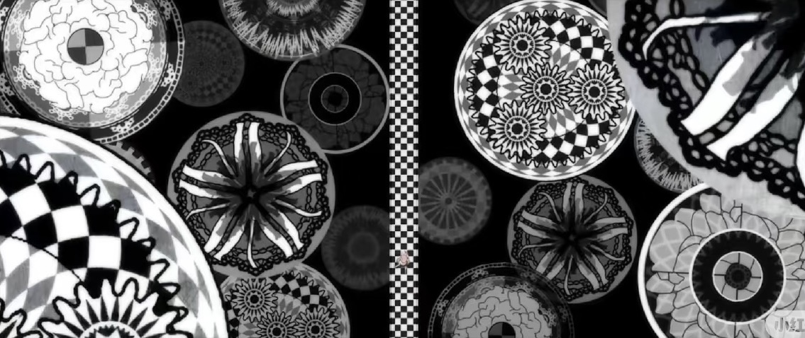
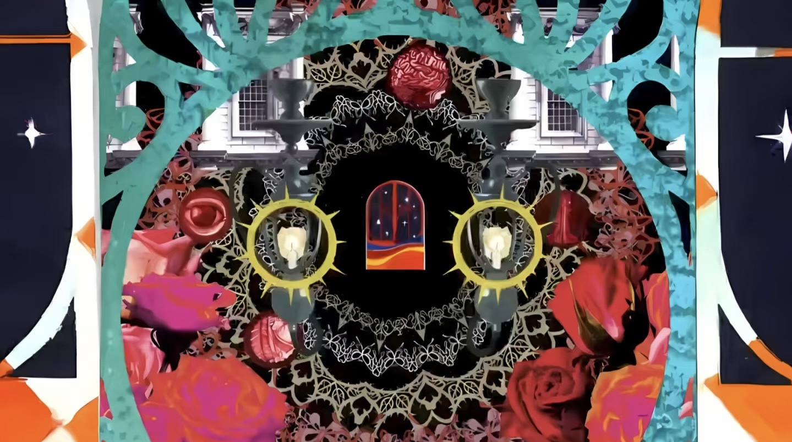
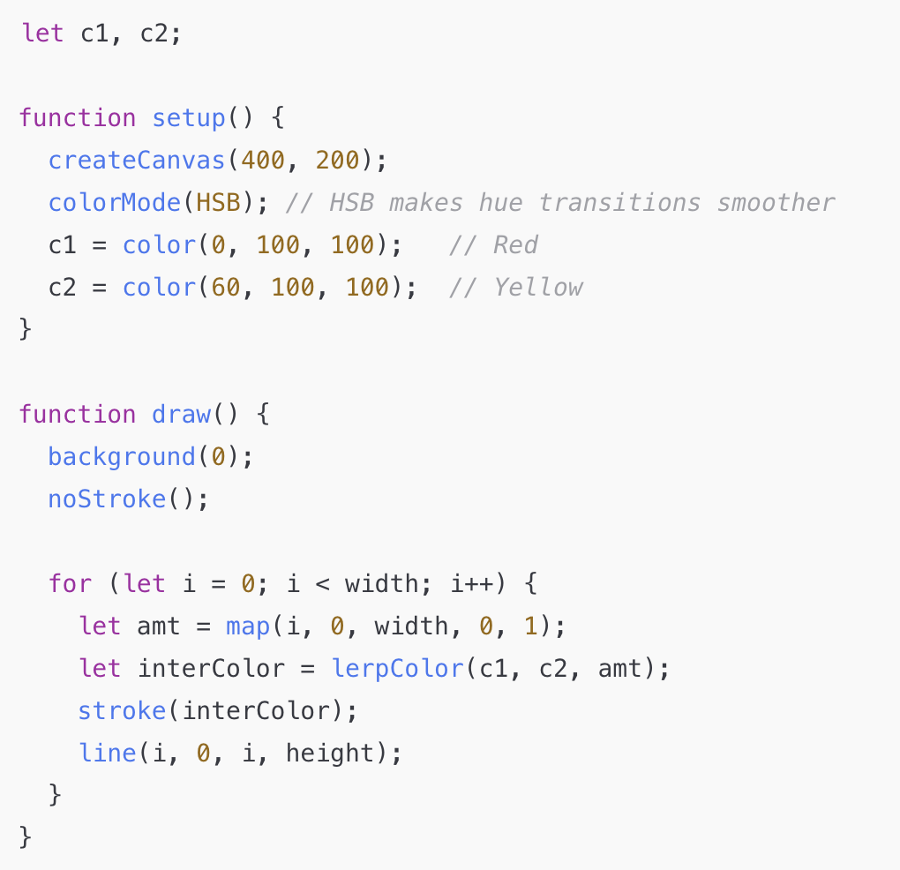
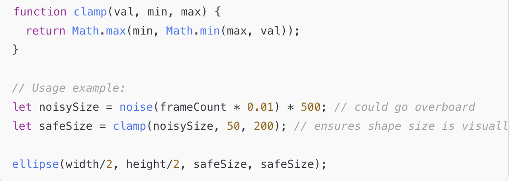

# ✨ 项目名称 / Project Title
Spindle of Dread
——基于Pacita Abad《Wheels of Fortune》的互动再构

Preview of Final Effect

## 1. 作品简介 / Description

<!-- 简要介绍我的作品，整体功能和动画效果 -->
在Pacita Abad《Wheels of Fortune》斑斓而狂乱的色块中，我初次看见的不是节日，而是生物。不是祈愿之轮，而是命运的组织体——细胞状、呼吸着、挣扎着的某种东西。

Original work: Wheels of Fortune by Pacita Abad

原作使用缤纷色彩缝合出强烈的视觉节奏，但在重绘过程中，我逐渐脱离了原有的庆典语境，开始意识到：当这些图案脱离布面、脱离手工的温度，转而进入数字平面与代码算法的运算时，它们不再是图案，而成为了某种“拟态生命体”。它们仿佛一群无法被命名的微生物，在屏幕上不断分裂、膨胀、呼吸着未知的逻辑。

The code-generated reinterpretation of Wheels of Fortune

这是一台不是由齿轮构成的“命运之轮”，而是一枚在暗中蠕动、反复旋转的**“恐惧纺锤（Spindle of Dread）”**——它呼应了柏拉图笔下那枚控制宇宙命运的Spindle of Necessity，却早已褪去理性与秩序的外衣，成为一个渗透着生理性与混沌感的异质装置。

我使用了Perlin noise赋予这些图形以持续波动的动态——如同某种“不均匀的呼吸”，让它们始终处于一种似活非活的状态。颜色则在random的算法中不断更换，但我刻意剔除了某些高饱和度色彩，保留了一组“毒蘑菇般”的迷人却危险的亮色组合——是自然界中“视觉毒性”的警告机制。

而当用户靠近——当鼠标hover触碰这些图案时，它们会像被窥见秘密的生物般迅速收缩，并陷入不规律的抖动之中，颜色转为压抑的深蓝与紫，仿佛正被逼入坏死的边缘。这是一种从“怪物”到“受害体”的反转，一种“命运之物”也会畏惧人类的假设。这一机制模拟了某种生态共震：

不是我们畏惧命运，而是命运也可能在畏惧我们。

这种交互动态并非为了模拟视觉上的“恐怖”，而是构建一种无处不在的异质感：你眼前的东西很美、很鲜艳，却永远不稳定。它活着、它变形、它惊惧、它无法被命名。你靠近的每一步，都是对这“命运轮转体”的扰动与感染。

在这场重构中，我试图将Pacita Abad原作中潜藏的生命性放大，并从“色彩盛宴”中引出一种更深的哲学隐喻：

命运并非机器，而是某种活着的、有情绪的存在。它不再冷酷，而是与你一样，会在凝视中改变。

---

## 2. 交互说明 / How to Use

Upon loading the page, users will immediately see a 520×520 canvas where the animation begins playing in a seamless loop. No clicks or input are required to start.

The animated experience features:

- Soft concentric rings rendered with smooth gradient transitions

- Elliptical shapes rotating slowly around their own centers

- Circular forms that pulse rhythmically in size and color

These visual elements operate in continuous cycles, creating a layered, meditative motion environment.

🖱️ Interactive Response to User Hover

Users can move the mouse cursor over any shape on the canvas to trigger subtle, lifelike responses:

Shape contraction: The hovered element will gradually shrink, as if reacting to contact or threat.

Color shift: Its hue will shift to cooler tones (e.g., deep blue or violet), suggesting tension or withdrawal.

Slight twitching: Prolonged hover may cause a trembling motion, resembling an involuntary spasm or pulse.

These responses simulate pseudo-biological behaviors, inviting users to explore the fragile, reactive nature of the system.

To experience new randomized visual outputs, users can simply refresh the page — each reload generates a distinct version of the animation.

---

## 3. 个人动画实现思路 / My Animation Approach

At the beginning of the group project, all visual elements were written together in sketch.js without modular structure. When transitioning into my individual work, the first thing I did was reorganize the codebase. I modularized the program by separating the Ring, Circle, and Ellipse logic into independent files. This allowed me to customize their animation behaviors independently and iterate more efficiently during the design process.

✨ Rhythm and Organic Motion
To simulate a life-like rhythmic effect, I leveraged Perlin noise in multiple ways:

- Radius fluctuation: Both Rings and Circles use noise() to smoothly increase and decrease their size over time—mimicking breathing or pulse-like movement.
- Angular perturbation: Ellipses use noise to distort their rotation angles, creating gentle, irregular oscillations that resemble the internal motion of cellular structures.
- Jitter and distortion: For Ring petals, I also used noise to add jitter to the angles and radii, adding complexity to the visual pattern.

🎨 Controlled Randomness
To enrich the animation, I used random() to dynamically change colors. However, to avoid overwhelming the composition with chaos, I limited the random selection to a curated color palette. This ensures the overall aesthetic remains vibrant but visually coherent.

⚙️ Techniques and Algorithms
Some of the techniques I implemented or plan to use include:

- lerpColor() for smooth color gradients across the Rings
- clamp() to restrict radius or angle values within a safe range
- map() to remap noise values into usable visual parameters
- Class-based encapsulation to support scalability and visual layering
- randomSeed() for test reproducibility when needed

🧭 Design Sequence

- Restructure the code for clarity and separation of logic
- Animate shape properties using Perlin noise and randomness
- Test each module independently (Ring, Circle, Ellipse)
- Balance color and motion by fine-tuning the value ranges
- Layer all components into a unified visual composition

🚀 Future Direction: Interaction
In the next stage, I plan to introduce user interaction to enhance the dynamic quality of the sketch. For example, mouse position could influence the speed of rotation, or clicking could switch between different color themes or ring behaviors. This will add a reactive, real-time layer to the artwork and make it feel more immersive and responsive.

---

## 4. 动画驱动方式 / Animation Driver

我选择的part：Perlin noise and randomness.

In my animation, I intentionally combined Perlin noise and random values to take advantage of their contrasting characteristics. Perlin noise offers smooth, continuous variations—perfect for creating organic, flowing movements like pulsing sizes or gentle rotation. On the other hand, random() introduces sharp, unpredictable changes that are ideal for dynamic elements such as color flickers or sudden visual contrast.

By blending both techniques, I was able to simulate motion that feels natural but still lively and surprising. For example, I used Perlin noise to modulate the radius and angle of rings, creating a "breathing" or "spinning" effect, while using random colors to add rhythm and visual variety. This dual approach allowed me to avoid monotony while still maintaining aesthetic coherence.

Additionally, by seeding randomness (randomSeed()), I could ensure reproducibility during testing while keeping the animation visually rich and unpredictable in the final output.

---

## 5. 动画的属性与独特性 / Animated Properties & Uniqueness

What makes my animation distinct from my group members’ work is the way I use both Perlin noise and randomness to simulate a sense of biological liveliness. Instead of static or purely reactive shapes, my elements feel as if they are “breathing” or subtly pulsating, like organic forms.

Specifically:

- I use Perlin noise to modulate the radius of Rings and Circles, as well as to offset the angle of Ellipses, creating fluid, rhythmic movement.
- I apply random color changes within a curated palette, adding visual diversity while avoiding chaos.
- The combination of these two techniques allows the shapes to appear alive—not only moving, but evolving—subtly shifting their size, orientation, and hue over time.

This approach emphasizes soft, continuous transformation, giving my animation a more organic and immersive character compared to designs driven by static values or fixed interactions.

---

## 6. 灵感来源 / Inspirations

✦ 灵感来源 Inspirations

1. 文献研究与文化象征
Research-based Insights

✿ Pacita Abad 与《Wheels of Fortune》

通过对菲律宾艺术家 Pacita Abad 的研究，我了解到她以大胆的色彩、织物拼贴与 trapunto 技法闻名，善于将个人身份、旅行经验与全球文化融入绘画之中。《Wheels of Fortune》是她晚期的重要作品之一，表面呈现出庆典式的图案与配色，但其强烈的层次感与生命节奏暗藏张力与混乱感，具有高度的开放性解读空间。

✿ “命运之轮”在西方文化中的象征

“Wheel of Fortune”是西方哲学与神话中的核心意象：

在古罗马与中世纪神话中，命运女神 Fortuna 控制着巨轮的转动，轮上之人随之升降，象征人生的无常、权力与悲剧的循环。
在塔罗牌中，“命运之轮”是一张充满能量与不确定性的卡牌，代表不可控的转变与系统性力量的干预。
这种象征常常呈现为非人性、不可对话、理性无法介入的命运力量，带有强烈的超现实或神秘主义色彩。

✿ 柏拉图的“命运之纺锤”（Spindle of Necessity）

在柏拉图《理想国》第十卷中，他描绘了一个宇宙的运转结构——“命运之纺锤”，由三位命运女神掌控，通过八层旋转圆环推动宇宙循环。这个结构既是宇宙机制的隐喻，也象征灵魂在轮回前所见的世界真理。

我将这个哲学结构作为象征借用，并结合作品的异质性发展出“Spindle of Dread（恐惧之纺锤）”的二创概念，既回应了文化典故，也为作品注入了生命感与情绪张力。

2. 个人视觉体验与推导过程
Subjective Perception and Conceptual Development

✿ 第一感知：生物性而非机械性

当我第一次观察原作并以代码重绘时，我并没有把它看作“命运的装置”或节庆的轮盘，而是感受到它更像一团细胞状、有机体般的聚合体。色彩的饱和、构图的密集、图形的重复让我联想到微生物、毒蘑菇、海洋软体生物等充满张力的自然生命体。

✿ 从“生物感”到“不安”：色彩与运动的转化

这种“不安”令我进一步联想到了一些有名的3D怪物创作，例如德国的艺术家Jonas Pfeiffer根据《圣经》的原文所“复原”的座天使。

这一形象彻底颠覆了传统宗教绘画中对天使的认知，将原本神圣温柔的存在转化为一种全然非人、甚至令人畏惧的生命结构。它不再具备人类的面孔与情感，而更像一种遥远的系统性存在——如同我们无法理解的程序、命令、命运本身。

这种视觉经验给了我重要启发：命运从不以人的面貌存在。它不是自然中的生物，也不是温柔的拟人化神灵，而是一种兼具“异质秩序”与“生理呼吸”的混合体。因此，我的创作也尝试在生物性的表皮之下，包裹住某种机械、抽象、无法沟通的内核——这就是我对“命运实体”的视觉想象。

在视觉与动画设计上，我也参考了《魔法少女小圆》中的部分场景构成。它的“魔女结界”所营造的氛围为我提供了重要启发：这些空间通常拥有强烈的秩序感与节奏性：

但其内部却是高度混乱、明亮、繁复且夸张的：

那种不断重复的图像、拼贴式的运动结构和无法辨识的异质视觉元素，常常令人迷失、焦躁，甚至产生轻度的不适感。这种张力与错乱，正是我在本作品中想要唤起的心理体验之一。

在动态编码过程中，我使用了 Perlin noise 模拟出“不均匀的呼吸”，加入了 random 色彩变化强化“拟生命感”，最终通过 hover 交互植入了“收缩—颤抖—变色”的连续行为，使这些图案看起来像具有情绪反应的生物体。

而这些生物并不友好。它们的颜色鲜艳到失真，它们永远不会稳定，它们感知你的靠近，并表现出防御甚至“坏死”的迹象。不安感由此产生——不是源于视觉暴力，而是一种感知上的紊乱。

✿ 联想深化：命运也是生物体

我逐渐意识到，这种反应机制本身就是一种命运的拟态表达：
命运不再是冷冰冰的轮盘或数学函数，而是一种具有反应性、被凝视即变形的生命体。它会回应你，会呼吸，会恐惧。甚至在某种意义上“不是我们在畏惧命运，而是命运也在畏惧我们”。

这种共生性的“恐惧生态”构成了我作品的核心意象，也是《Spindle of Dread》命名与逻辑体系的出发点。

---

## 7. 技术实现说明 / Technical Explanation

Overall Workflow

1. Load shape data → 读取静态图形数据（circle, ellipse, ringConfigs）
2. Initialize visual elements → 初始化动画参数与颜色池
3. Per frame (draw loop):
   - Render background elements
   - Animate ellipses (rotation via noise)
   - Animate circles (radius via noise)
   - Animate rings (jitter, gradient fill, smooth morphing)
  
Main Animation Strategy / 核心动画策略：
   - Use Perlin noise to control rotation angles, jitter, and radii → creates smooth organic motion
   - Use random() to assign colors dynamically to keep the visuals vibrant
   - Use trigonometric functions (sin, cos) to draw radial/petal patterns
   - Encapsulate complex motion (like ring halo animations) in custom classes (Ring)
  
Animation Logic Overview

// 初始化
载入图形数据：椭圆点 ellipseData[], 圆圈点 circlesData[], Ring 配置 ringConfigs[]
创建 Ring / Ellipse / Circle 等类实例并保存到数组中

// setup()
设置画布、颜色模式、绘图样式
对每个图形对象赋初始噪声种子、颜色、大小等属性

// draw()
清空背景

遍历所有图形对象，依次执行：
  - 计算当前帧数 frameCount
  - 用 Perlin Noise 控制：
      - 圆圈的半径变化（呼吸感）
      - 椭圆的角度偏移（旋转感）
      - Ring 的半径 jitter / angle / noise 曲线（花瓣形变）
  - 用 Random 选择新的颜色填充（颜色跳动）
  - 调用每个对象的 display() 函数绘制到屏幕上

// 每个 display() 函数内部流程
  根据图形类型绘制圆形、椭圆或环形
  应用颜色渐变、旋转、半径扰动等动画效果

Key Algorithms and Techniques Used

| Technique | Purpose | Effect |
|-----------|---------|--------|
| **Perlin Noise** | Controls size fluctuation, angle variation, and position jitter of shapes (especially rings) | Creates smooth, continuous "breathing" animations and avoids abrupt transitions |
| **Random() function** | Dynamically changes fill colors | Enhances the randomness and richness of the animation |
| **Trigonometric functions (sin/cos)** | Used to draw polar-based shapes (e.g. petals, rings, rotating ellipses) | Produces regular radial or rotational motion effects |
| **lerpColor() color interpolation**  *(Suggested by ChatGPT)* | Generates smooth color gradients for animated rings | Creates a flowing sense of light and spatial depth |
| **Modular class structure**  (Ring / EllipsePattern / CirclePattern) | Encapsulates the behavior of each shape type | Makes the code easier to scale, reuse, and debug; each class handles its own animation logic |
| **Multi-layer rendering and overlay** | Draws multiple types of graphics on the same canvas | Adds depth and complexity to the visual output |

---

## 8. 组代码的修改 / Changes to Group Code

* When I started working on the individual assignment, our group’s shared code had everything written in a single `sketch.js` file. So I modularized the code based on my own needs. The original structure already grouped the patterns to some extent, but I went a step further and separated the ellipses, circles, and rings into different files. This made it much easier for me to apply animations and iterate on their behavior.

* I also removed the `noLoop()` function from the original code to allow continuous redrawing. This change enables my rings to create a "high-speed spinning" effect.

---

## 9. 课外工具与技术 / External Tools & Techniques

1. lerpColor() – Color Interpolation (Beyond the Course Scope)
Although lerp() (linear interpolation) is a commonly used technique, in this project I specifically used p5.js’s lerpColor() function to create smooth color transitions. This method wasn’t part of the original course code and was introduced to me through a suggestion from ChatGPT.

✨ Why I Chose It
I wanted the rotating ring shapes (Ring objects) to display a smooth color gradient that resembled a glowing or energetic aura. Using random() to switch colors resulted in sudden, jarring changes. In contrast, lerpColor() allowed for continuous, fluid transitions between colors, producing a more natural and visually appealing animation.

⚙️ How It Works
The function lerpColor(c1, c2, amt) calculates a color somewhere between c1 and c2 based on amt, a value between 0.0 and 1.0. Internally, it performs linear interpolation on each individual color channel (such as HSB or RGB), producing a smooth blend.

Formula: result = (1 - amt) * c1 + amt * c2 (applied to each channel)

🧪 Example Code

🎨 In my actual Ring class, I applied this same technique to transition between multiple colors as the ring rotates, enhancing the sense of motion and depth.

2. clamp() – Value Bounding Function (Custom Utility)
The clamp() function is a simple yet essential mathematical utility that restricts a value to lie within a specified range. I used this in my animation logic to prevent properties such as radii, angles, and noise-influenced values from going beyond meaningful bounds. This code is also from ChatGPT.

✨ Why I Chose It
When working with dynamic values—especially those driven by Perlin noise or random functions—it's easy for parameters to exceed the expected visual range, resulting in shapes that are too large, too distorted, or even invisible. By applying clamp(), I ensured that all animation inputs stayed within safe, aesthetic limits.

⚙️ How It Works
clamp(value, min, max) returns min if value is below the minimum, max if it's above the maximum, and the value itself if it lies within the range. This guarantees that the result always remains within [min, max].

Formula:
If value < min, return min
If value > max, return max
Otherwise, return value

🧪 Example Code

🔧 In my Ring and CirclePattern modules, I used clamp() to restrict radius growth and avoid extreme jitter, preserving visual harmony even under animated transformations.

## 10. 作品迭代 / External Tools & Techniques

1. 第一次上传的时候我仅尝试了自动动画。

在用户测试中，我发现原作的墨蓝色背景虽然强化了压迫感，但也导致部分观众感到过度不适。于是我将背景改为明亮的中黄色，并优化了颜色池中饱和度过高的选项，删除了可随机的颜色中那些不和谐的颜色。这样调整后，整体画面更具活力，色彩也更接近热带毒菌或深海生物的“鲜艳警示”状态。不安感没有被削弱，反而因伪装在“活泼色彩”之下的痉挛与退缩反应，变得更加隐蔽和真实。

与此同时，我意识到，仅仅以旁观者的角度观看动画显得略显单调。由于用户无法干涉这些“生物”的行为，它们反而更像是在执行预设程序，缺乏生命应有的感知与反应。因此，我决定引入一项简单的用户交互机制，以打破这种“机械感”。

具体做法是：当用户将鼠标悬停在任意一个 Ring 上时，该图形会立即收缩，模拟出生物在受到触碰或惊扰时本能的退缩反应。

2. 第二次迭代中，我为作品加入了鼠标悬停（hover）交互机制。

但我很快意识到，Ring仅仅在悬停时发生收缩虽然营造出一种仿佛生物痉挛般的动态效果，但情绪表达仍然不够强烈。为了进一步强化视觉与情感的冲击力，我决定结合 random() 和 lerpColor()，让Ring在收缩的同时产生颜色变化，逐渐转向深蓝或深紫。这种颜色变化模拟了“窒息”与“濒死”的感受，增强了作品所传达的不安的氛围。

3. 第三次迭代后就是我的个人作品的最终效果、

